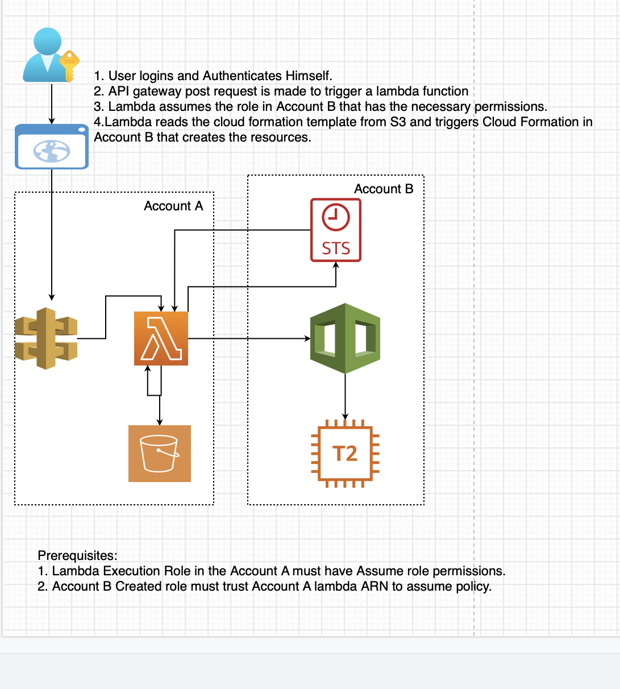

# AWS Resource Creation on Button Click

This folder contains code that Deploys an EC2 t2.micro instance on the click of a button. 

**Website** :

The working Project URL can be accessed at [https://sampathcodes.com/agw_post.html](https://sampathcodes.com/agw_post.html)

**Architecture Diagram** :

**Directory Structure** :

Code Files | Content Info
------------ | -------------
sample_ec2_template.json | EC2 cloud formation template hosted on AWS S3 that creates T2.micro instance
test_lambda_func.py | Lambda Function to execute cloud formation template
agw_post.html | html file that contains the button that triggers the api gateway.

**Prerequisites** : 

1. Lambda execution role in  Account A must have assume role permissions.
2. Account B Created role must trust Account A lambda ARN in it's trust policy.

**Execution Steps** :

1. User logins and Authenticates Himself.
2. An API gateway post request is made to trigger a lambda function from the Web page.
3. Lambda in Account A assumes the role in Account B that has the necessary permissions for resource creation
and code deployment.
4. Lambda reads the cloud formation template from S3 and triggers Cloud Formation in 
Account B that creates the resources.

